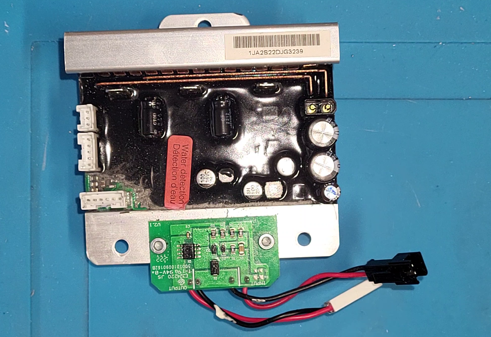
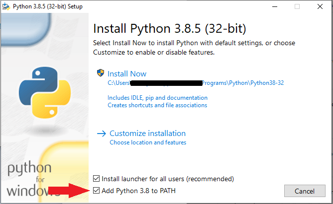
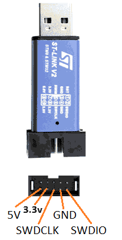
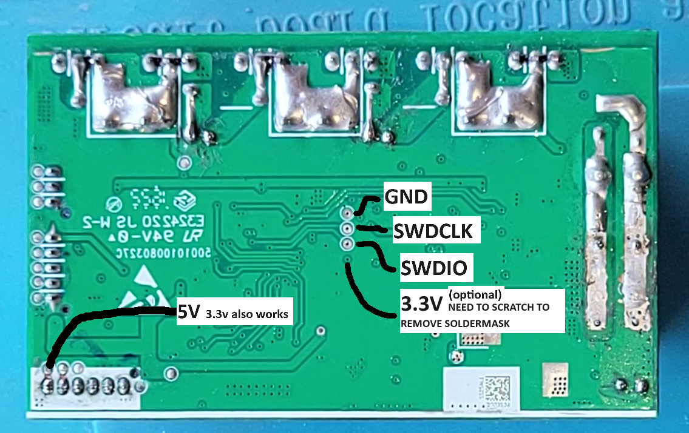
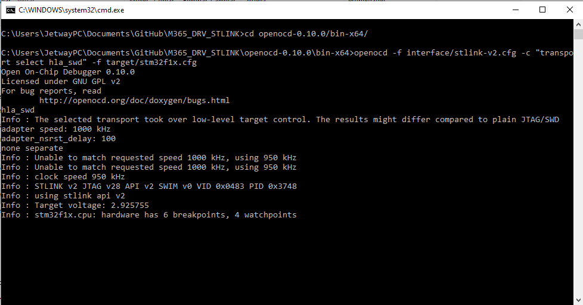
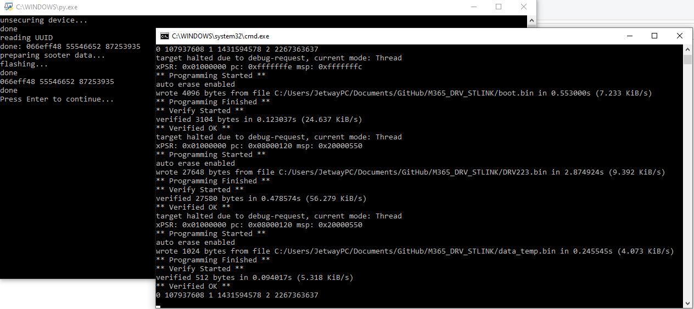

# m365-Electric-Scooter-4-Pro-st-link

M365 4 pro first gen driver esc recover due to DRV BRICK, or to flash a custom version using st-link. Disclaimer, I'm not responsible for any damage, do this at your own risk.
* make sure your model is an Electric-Scooter-4-Pro first generation. The DRV photo must match your DRV.

  

* take note of your current serial so you can restore it during the process.

# What is needed?
* ST-LINK V2 or similar programmer
* ST-LINNK drivers, install ST_LINK_SETUP.exe
* [Python 3.8](https://www.python.org/downloads/)- make sure to check Add Python to path

* Some DuPont wires and some alligator clips
* Bricked part and optionally its Serial number, the first 5 characters define the region:

  * 35802 is EU limited to 25Kmh
  * 35804, 35803, 38190 other regions, limited to 25Kmh
  * 35806 is German, limited to 20Kmh
  * 38191 other region limited to 20Kmh
  * 38949 is US limit 30Kmh

* Optional some solder equipment or someone to help you holding the wires in place
* patience
# flashing

1. Select the flash_pro4_1gen.py if you want stock firmware or flash_pro4_1gen-hack.py if you want modded version with:
   - reduced start speed to 3kmh
   - modified speed limits: eco 20kmh, drive 25kmh and sport 32kmh
   - removed charging state
   - disabled OTA protection
1. Open it on a text editor, on line 26 you can find something that goes like this

  *   serial ='35802/CHAABBCCDDEEFF'
        KM=0
      
  * replace the data to match your actual scooter serial and KM
3. Disassemble scooter and extract the DRV.
3. Prepare the DRV, two possibilities: remove it from the heatsink and access the programming pads under it or remove the black jelly (WITH A PLASTIC TOOL) to access the pads from the top
  * Make sure the capacitor is discharged. To achieve this disconnect the battery, try to turn the scooter on and wait until the red light fades
2. Hold wires in place, solder them, or ask help for a friend to hold them during the process

Use the top approach to avoid heatsink disassembly but need to remove the silicone around the programming pads (remove the silicone only around the shown pads)

or use the bottom approach to avoid removing silicone but need to disassemble the heatsink ( disassembly process shown here https://youtu.be/qNV4QCbPcdQ?si=TDDuNF-3IJuzh60k )

- Launch start_ocd_STLINKV2.bat, should start like this, if it doesnt, check the wirig, open STM32 STLink Utility, try to connect to target to check if stlink is working
  
- Launch flash_......py
- Wait, if it fails and closes check the wiring, close everithing, reconect the stlink and restart from step 2. 
* open STM32 STLink Utility and try to connect to target to check if stlink is working.
6. If everithing works you should see something like this:

